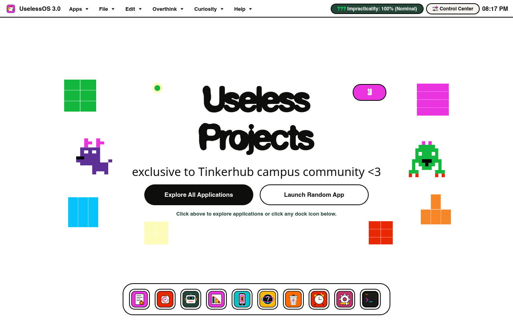
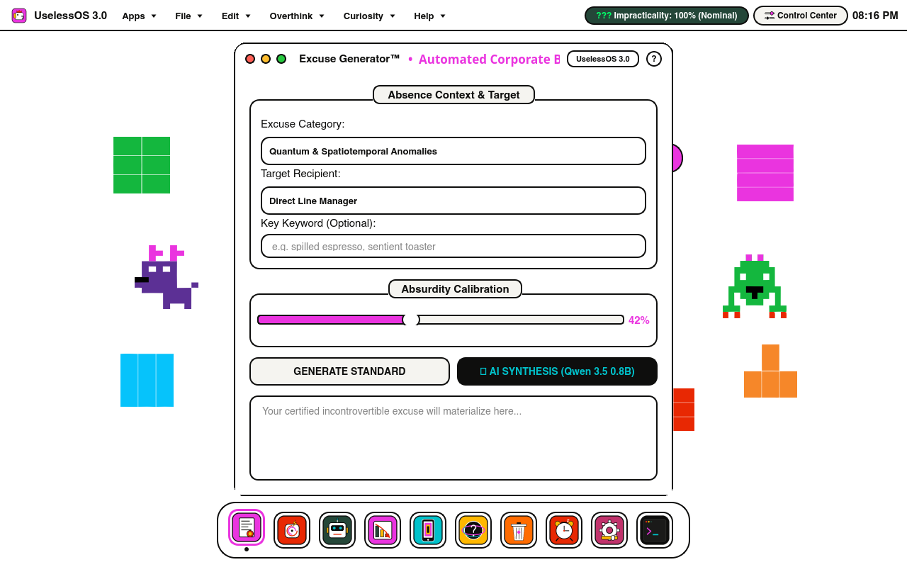
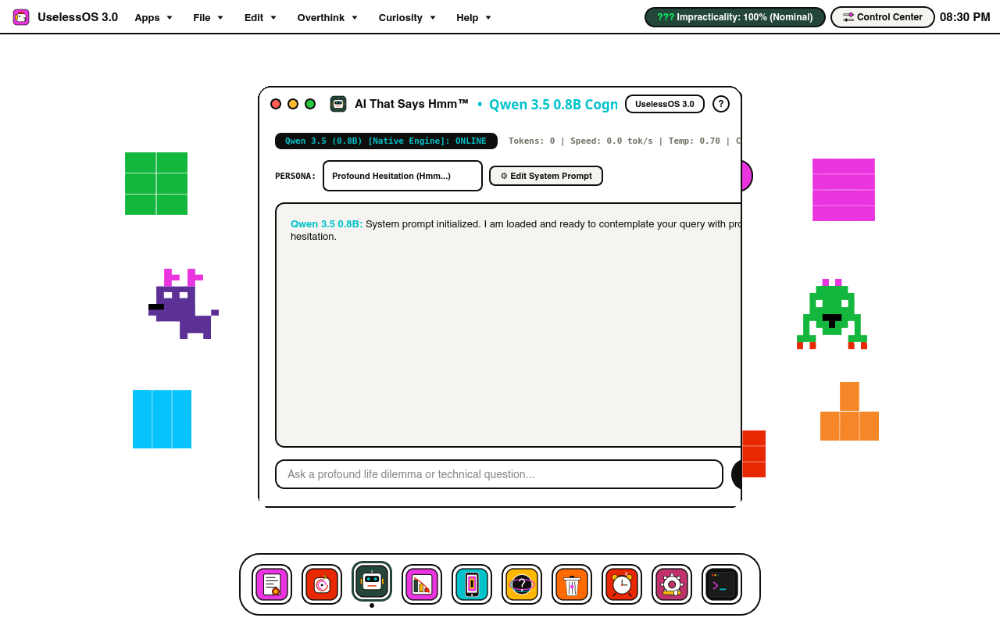
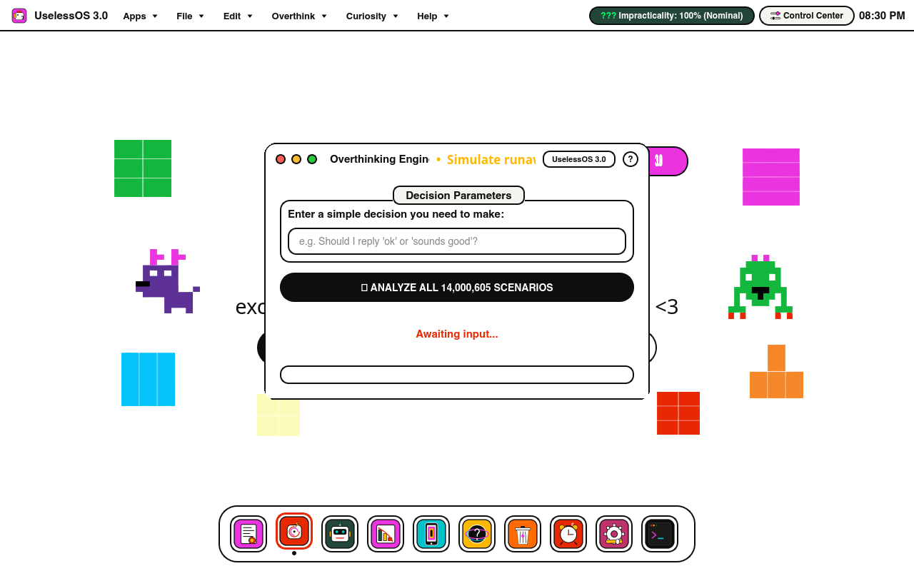

# UselessOS 3.0

## Basic Details
### Team Name: Individual Project

### Team Members
- Team Lead: Edwin Joseph - Mar Baselios Christian College of Engineering and Technology, Kuttikkanam

### Project Description
UselessOS 3.0 is a custom Linux OS appliance combining TinkerHub's Neobrutalist aesthetic with macOS interaction architecture. Packed with 10 certified impractical apps, a live Dock, Control Center, and local AI, it transforms zero productivity into an art form--100% offline, absurdly polished, and delightfully useless.

### The Problem (that doesn't exist)
Modern operating systems and desktop environments have become overwhelmingly practical, hyper-efficient, and suffocatingly productive. Users are continuously inundated with actionable notifications, automated calendars, seamless cloud synchronization, and functional spreadsheets. This leaves zero cognitive bandwidth for certified procrastination, cosmic overthinking, and non-committal computational silence.

### The Solution (that nobody asked for)
UselessOS 3.0 solves this non-existent crisis by delivering a bootable Linux desktop environment engineered with obsessive craftsmanship to accomplish certified zero real-world utility. Built from scratch with a custom Neobrutalist macOS-inspired shell (Top Bar, Control Center, Launchpad, and Dock), it hosts 10 bespoke native applications--ranging from an AI that only says "Hmm" to an Overthinking Engine that simulates 14,000,605 catastrophic outcomes--allowing users to procrastinate with enterprise-grade elegance.

## Technical Details
### Technologies/Components Used
For Software:
- Languages: Python 3, C++20, Bash, PowerShell
- Frameworks: Qt 6 / PyQt6, PyQt5 (with qt_compat fallback)
- Window Management & Compositing: Openbox, Picom (damage-aware), KWin Wayland, X11
- AI & Cognitive Engines: Qwen 2.5 / 3.5 0.8B ChatML inference model, llama-server
- System Tools & Packaging: Oracle VirtualBox, Vagrant, CMake, xrandr, nmcli, pactl, rfkill, wmctrl

For Hardware:
- Main Components: N/A (Pure Software / Virtualized Operating System Appliance)
- Host Hardware Requirements: x86_64 host CPU with VT-x/AMD-V virtualization enabled, minimum 4 GB host RAM, 10 GB disk space
- Virtual Machine Specifications: 2 vCPUs, 2048 MB RAM, 128 MB VRAM, VMSVGA graphics adapter with 3D acceleration, AC97 audio
- Tools Required: Oracle VirtualBox 7.0+ (or Vagrant) on Windows, macOS, or Linux

### Implementation
For Software:

# Installation

Download the pre-built VirtualBox OVA appliance (UselessOS.ova) or bootable hybrid Live ISO (UselessOS-3.0-amd64.iso) from GitHub Releases or GitHub Actions build artifacts.

To install and import UselessOS on Windows:
```cmd
INSTALL-UselessOS.bat
```
Or build the bootable Live ISO directly on Linux:
```bash
sudo bash scripts/build-iso.sh
```
Or build and provision from source using Vagrant:
```bash
vagrant up
```

# Run

To launch the virtual machine and open the desktop:
```cmd
START-UselessOS.bat
```
Or start directly from VirtualBox:
```bash
VBoxManage startvm "UselessOS" --type gui
```

### Project Documentation
For Software:

# Screenshots

*UselessOS 3.0 Desktop Environment featuring macOS-inspired Top Bar, TinkerHub Neobrutalist Mascot Canvas, and 10-application bottom Dock*


*Excuse Generator running in a native brutalist window with traffic light controls and active Dock tracking indicator*


*AI That Says Hmm connected to the local Qwen cognitive engine with live ChatML reasoning*


*Overthinking Engine simulating 14,000,605 catastrophic scenarios for trivial life dilemmas*

# Diagrams
```
+-------------------------------------------------------------------------+
|                              Host Machine                               |
|               (Windows / macOS / Linux with VirtualBox 7.0+)            |
+------------------------------------+------------------------------------+
                                     |
                                     v
+-------------------------------------------------------------------------+
|                           UselessOS Guest VM                            |
|                       (Debian 12 Bookworm 64-bit)                       |
+------------------------------------+------------------------------------+
                                     |
                                     v
+-------------------------------------------------------------------------+
|                  Display Server & Compositing Pipeline                  |
|                (X11 / Openbox + Damage-Aware Picom Backend)             |
+------------------------------------+------------------------------------+
                                     |
                                     v
+-------------------------------------------------------------------------+
|                  UselessOS Native PyQt6 Desktop Shell                   |
|  +-------------------+  +-------------------+  +---------------------+  |
|  | Top Bar (Clock,   |  | Control Center    |  | Bottom Dock         |  |
|  | Menus, Status)    |  | (Hardware Toggles)|  | (Live App Switcher) |  |
|  +-------------------+  +-------------------+  +---------------------+  |
+------------------------------------+------------------------------------+
                                     |
                                     v
+-------------------------------------------------------------------------+
|                  10 Certified Useless Native Applications               |
|  - Excuse Generator                - Overthinking Engine (14M states)   |
|  - AI That Says Hmm (Qwen Engine)  - Uselessness Analytics              |
|  - Screen Time Calculator          - Existential Crisis Tracker         |
|  - Emotional Support Bin           - Alarm That Doesn't Wake You        |
|  - Placebo Settings                - Sub-Command Line Terminal          |
+-------------------------------------------------------------------------+
```
*Architectural workflow of UselessOS showing the virtualization layer, compositing pipeline, native desktop shell, and application suite.*

For Hardware:
N/A - UselessOS is a software-based virtual operating system appliance.

### Project Demo
# Video
<video src="docs/screenshots/useless_demo.mp4" width="100%" controls>
  Your browser does not support the video tag.
</video>
*Walkthrough demonstrating the boot sequence, desktop interaction, Control Center, and launching useless applications.*

# Additional Demos
- Interactive batch launcher: START-UselessOS.bat
- Automated VirtualBox appliance importer: INSTALL-UselessOS.bat

## Team Contributions
- Edwin Joseph: Conceived and engineered the complete system architecture, native PyQt6 desktop shell, C++ window tracker, TinkerHub Neobrutalist design system, 10 certified useless native applications, local Qwen cognitive backend, and automated Windows launcher scripts.

---
Made at TinkerHub Useless Projects 


